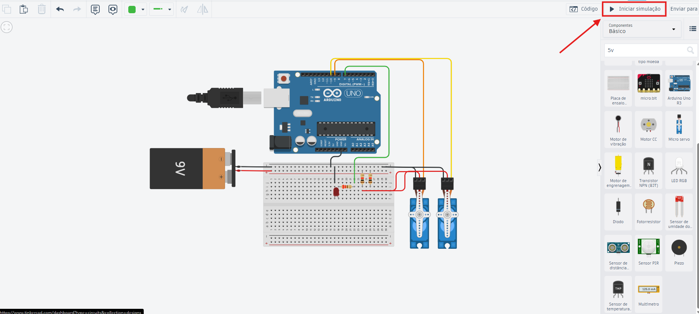
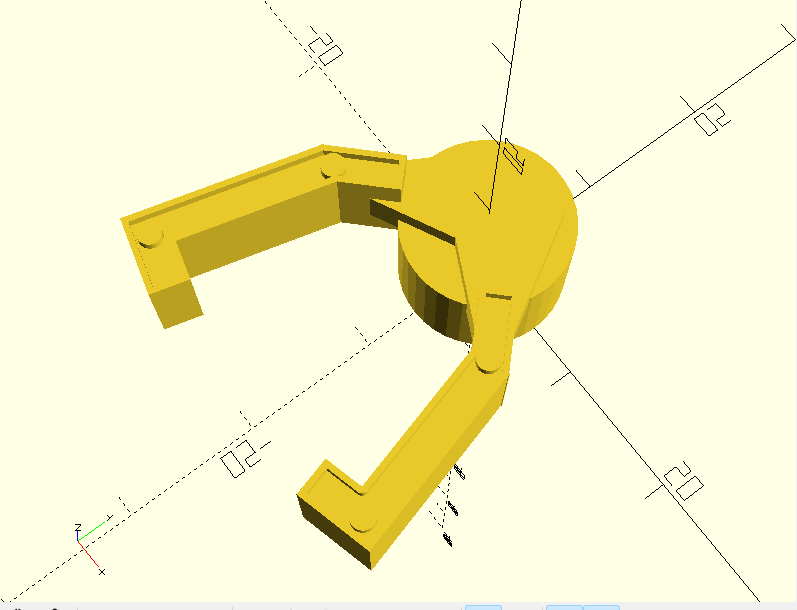
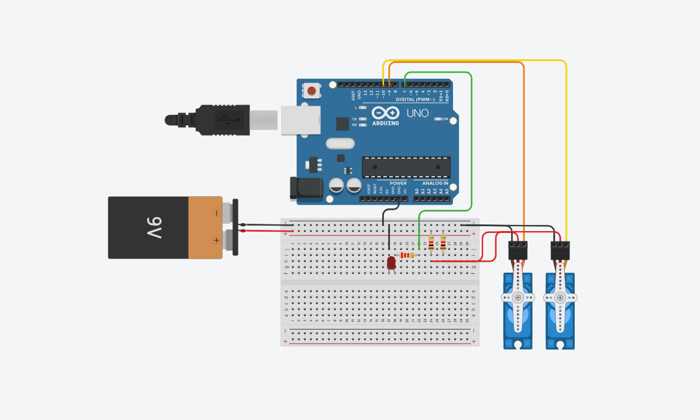

# 🤖 Braço Robótico de Coleta de Amostras (Docking & Retrieval)

Projeto educativo de um braço robótico para manipulação de carga em ambiente de microgravidade, controlado pelo Monitor Serial do Arduino.

## 📚 Índice

- [💻 Código fonte Arduino](codigos/codigo.ino)
- [🛠️ Código fonte da garra (OpenSCAD)](codigos/garra-projeto.scad)
- [🎥 Vídeo de demonstração](https://youtu.be/_FJ1rqBvlM8)
- [🧪 Protótipo no Tinkercad](https://www.tinkercad.com/things/0Z2C0dtAfY0-stunning-inari?sharecode=F12u4teVuH8yl4K8QwjvtEXMKWHTwdDilnZQZ8fhvbM)

## 📌 Descrição do projeto

O projeto simula um braço robótico de coleta de amostras para ambientes de microgravidade. Ele usa um Arduino Uno, dois servomotores que representam articulações do braço e um LED de status. O controle é feito por comandos de teclado no Monitor Serial.

### 🎯 Objetivo

- Manipular objetos com comandos simples.
- Simular um braço de recuperação/docking em condições de baixa gravidade.
- Mostrar o circuito em ambiente de simulação (Tinkercad ou Wokwi).
- Documentar o modelo da garra em OpenSCAD.

## 🧩 Materiais e componentes

- Arduino Uno
- 2 servomotores
- LED de status
- Fios de conexão
- Fonte de bancada do simulador configurada para 5V ou 6V

## 🧭 Como usar no Tinkercad

### 1. 🔍 Abrir o projeto

Abra o projeto público do Tinkercad no link acima.

### 2. ▶️ Inicie a simulação
 

Utilize o botão "Iniciar simulação" no canto superior direito para começar a simulação

### 3. 💬 Abrir o monitor serial
 
Com a simulação iniciada acesse a aba "Código"

 
Depois localize o "Monitor serial" na parte inferior na aba código

### 4. ⌨️ Usar os comandos

Digite as letras abaixo no Monitor Serial e envie cada comando:

- `U` — levanta o braço (posiciona o servo do braço em 120°)
- `D` — abaixa o braço (posiciona o servo do braço em 30°)
- `O` — abre a garra (servo da garra em 90°)
- `C` — fecha a garra (servo da garra em 0°)

> O LED de status acende quando o braço está levantado e apaga quando o braço está abaixado.

> Caso haja dúvida assista nosso video demontrando a execução do protótipo. O link está disponível no índice

### 6. 🖼️ Imagens de referência
 
 

## 🦾 Garra

A garra foi desenhada em OpenSCAD e representa o "Grip" de coleta da amostra. O arquivo `codigos/garra-projeto.scad` contém o modelo 3D, que pode ser usado para impressão ou análise CAD.

## 👥 Membros do Grupo
| Nome                                | RM       |
|-------------------------------------|----------|
| 🍙 Fernanda Kaory Saito             | RM551104 |
| ⚡ João Pedro Borsato Cruz          | RM550294 |
| 💫 Maria Fernanda Vieira de Camargo | RM97956  |
| 🚀 Pedro Lucas de Andrade Nunes     | RM550366 |
| 💥 Vinícius Bernardino de Souza     | RM97888 |

