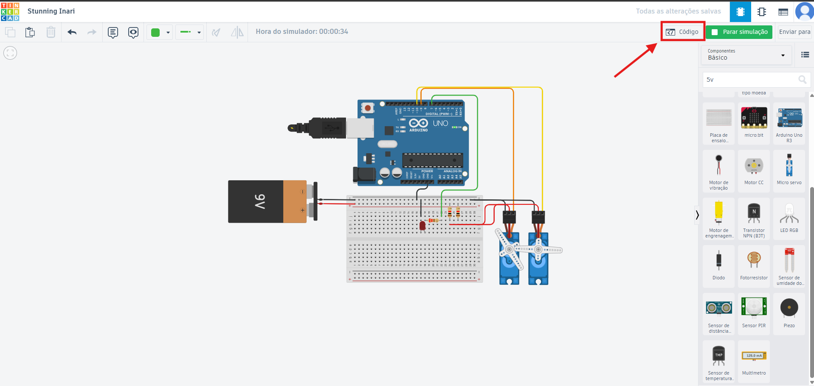
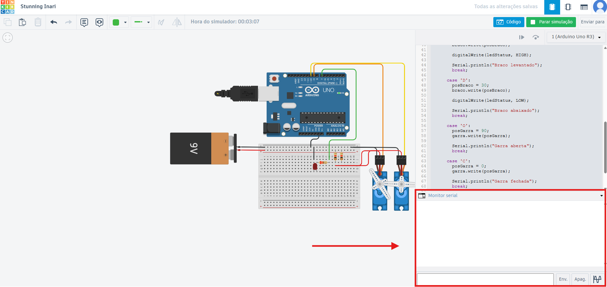

# 🤖 Braço Robótico de Coleta de Amostras (Docking & Retrieval)

Projeto educativo de um braço robótico para manipulação de carga em ambiente de microgravidade, controlado pelo Monitor Serial do Arduino.

## 📚 Índice

- [💻 Código-fonte Arduino](src/codigo.ino)
- [🛠️ Modelo 3D da garra](model/garra-projeto.scad)
- [🎥 Vídeo de demonstração](https://youtu.be/_FJ1rqBvlM8)
- [🧪 Protótipo no Tinkercad](https://www.tinkercad.com/things/0Z2C0dtAfY0-stunning-inari?sharecode=F12u4teVuH8yl4K8QwjvtEXMKWHTwdDilnZQZ8fhvbM)
- [🖼️ Galeria de imagens](#galeria)

## 📌 Identificação

- Projeto: Braço Robótico de Coleta de Amostras (Docking & Retrieval)
- Software de modelagem: OpenSCAD

### 👥 Integrantes
| Nome                                | RM       |
|-------------------------------------|----------|
| 🍙 Fernanda Kaory Saito             | RM551104 |
| ⚡ João Pedro Borsato Cruz          | RM550294 |
| 💫 Maria Fernanda Vieira de Camargo | RM97956  |
| 🚀 Pedro Lucas de Andrade Nunes     | RM550366 |
| 💥 Vinícius Bernardino de Souza     | RM97888 |

## 🧪 Acesso ao simulador

- Projeto público Tinkercad: https://www.tinkercad.com/things/0Z2C0dtAfY0-stunning-inari?sharecode=F12u4teVuH8yl4K8QwjvtEXMKWHTwdDilnZQZ8fhvbM

## 🧭 Guia de operação

Digite os comandos seriais no Monitor Serial do Arduino para controlar o braço robótico.

- `U` — levanta o braço (servo do braço para 120°)
- `D` — abaixa o braço (servo do braço para 30°)
- `O` — abre a garra (servo da garra para 90°)
- `C` — fecha a garra (servo da garra para 0°)

> O LED de status acende quando o braço está levantado e apaga quando o braço está abaixado.

## ⚙️ Especificações técnicas

- Fonte configurada no simulador para 5V ou 6V
- Arduino Uno
- Pinagem:
  - Servo do braço: pino 9
  - Servo da garra: pino 10
  - LED de status: pino 7

## 🧩 Materiais e componentes

- Arduino Uno
- 2 servomotores
- LED de status
- Fios de conexão
- Fonte de bancada do simulador configurada para 5V ou 6V

## 🧭 Como usar no Tinkercad

### 1. 🔍 Abrir o projeto

Abra o projeto público do Tinkercad no link acima.

### 2. ▶️ Inicie a simulação

Utilize o botão "Iniciar simulação" no canto superior direito para começar a simulação.

### 3. 💬 Abrir o monitor serial

Com a simulação iniciada, acesse a aba "Código".

Depois localize o "Monitor serial" na parte inferior da aba Código.

### 4. ⌨️ Usar os comandos

Digite as letras abaixo no Monitor Serial e envie cada comando:

- `U` — levanta o braço (servo do braço para 120°)
- `D` — abaixa o braço (servo do braço para 30°)
- `O` — abre a garra (servo da garra para 90°)
- `C` — fecha a garra (servo da garra para 0°)

> O LED de status acende quando o braço está levantado e apaga quando o braço está abaixado.

> Caso haja dúvida, assista ao vídeo de demonstração. O link está disponível no índice.

## 🖼️ Galeria

- `images/circuito.png` — captura de tela do circuito no simulador.
- `images/garra.png` — modelo 3D da garra.

## 🦾 Garra

A garra foi desenhada em OpenSCAD e representa o "Grip" de coleta de amostras. O arquivo `model/garra-projeto.scad` contém o projeto 3D e `model/garra-stl.stl` é a versão exportada para STL.

